# Selenium Python 

¿Que es selenium?

Suite de herramientas para automatización de navegadores. 

Compatible con Firefox, Chrome, Explorer, Safari y Opera

Compatible con distintos lenguajes de programación como: Java, C#, Kotlin, PHP, Python, Ruby y JavaScript

El objetivo de Selenium NO fue para el Testing ni para el Web Scraping (aunque se puede usar para eso), por lo tanto, no es el más optimo para estas actividades.

Protocolo: WebDriver, herramienta que se conecta a un API.
Selenium WebDriver es la herramienta que utilizaremos en el curso.

- Selenium NO es un Software, ES una SUIT de Softwares.
- DDT: Data Drive Testing: Ingresar datos para que realice varias pruebas (sin intervención humana).

Cuando hablemos de Selenium en el curso estaremos hablando de **"Selenium Web Driver"**

-----------------------------------

Algunas herramientas de testing y automatización:

**Puppeteer:**

• PROS: Soporte por parte de Google, te brinda datos del Performance Analysis de Chrome y un mayor control de este navegador. No requiere archivos externos como lo hace Selenium con WebDriver.

• CONTRAS: Solo funciona para Google Chrome con JavaScript, tiene una comunidad pequeña así que el apoyo será poco.

**Cypress.io:**

• PROS: Tiene una comunidad emergente y va creciendo a pasos acelerados, tiene muy buena documentación para implementar Cypress en los proyectos. Es muy ágil en pruebas E2E, está orientado a desarrolladores y tiene un excelente manejo del asincronismo, logrando que las esperas sean dinámicas y también se puedan manejar fácilmente.

• CONTRAS: Solo funciona en Google Chrome con JavaScript, se pueden realizar pruebas en paralelo únicamente en la versión de pago.

-----------------------------------------

**Configuración de entorno Selenium:**

Python V 3.6 o superior

si estas en la terminal de ubuntu

1 : sudo apt update
2 : apt install python3-pip
3 : pip3 --version
4 : pip3 install selenium
5 : pip3 install pyunitreport (Librería para hacer reportes en HTML para python)
6 : pip freeze > requirements.txt

Finalmente debemos buscar los drivers del navegador con el queramos trabajar. En mi caso busco los ChromeDriver - WebDriver e instalo el que corresponde a mi sistema operativo. 

---------------------------------------

**Unittest (PyTest):**

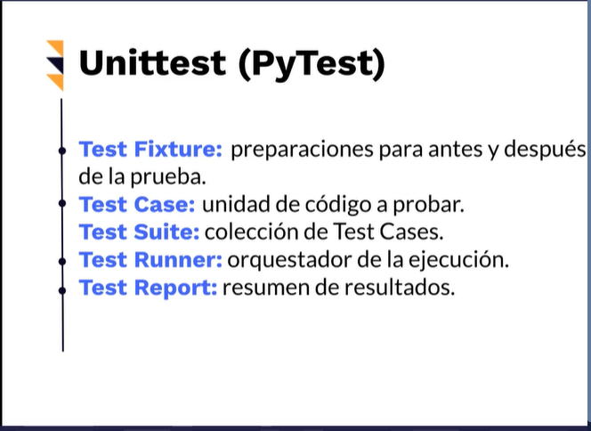

---------------------------------------

¿Como hacemos para que al correr pruebas unitarias no se cierren las ventanas que abrimos de forma automatica con selenium? 

1- Agregamos a setUp y a tearDown una anotación arriba del tipo @classmethod
2- cambiamos el "self" de esos metodos por "cls" en todos los lugares donde antes aparecía

Ejemplo de test result corrido así: 

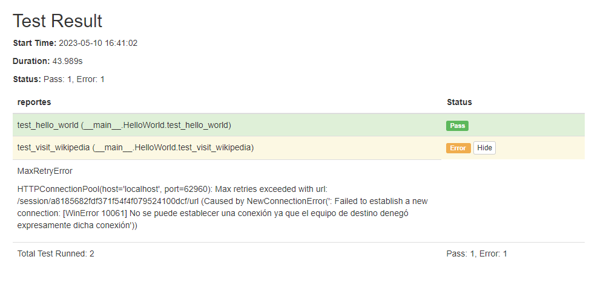

-----------------------------------------

**Encontrar elementos de un sitio web para luego interactuar con ellos usando find_element** 

Recordemos la estructura de un sitio web. Es HTML:

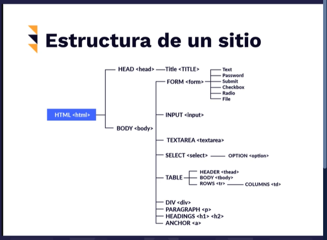

¿Como vamos a llegar a estos elementos? A traves de los selectores que son estos:

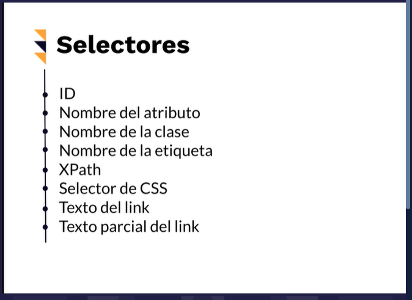

Entonces por ejemplo abro esta pagina creada con fines educativos:

http://demo-store.seleniumacademy.com/

Abro el inspector de elementos y busco el id o una identificación de la barra de busqueda para poder interactuar con el misma mediante el find_element. 

El elemento en cuestion es:


<input id="search" type="search" name="q" value="" class="input-text required-entry" maxlength="128" placeholder="Search entire store here..." autocomplete="off">

"input id="search" type="search" name="q" value="" class="input-text required-entry" maxlength="128" placeholder="Search entire store here..." autocomplete="off""

Vamos a testearlo a traves un file/class de python llamado HomePageTest.py...

Y el resultado de mi test es que encontró el elemento que buscamos: 

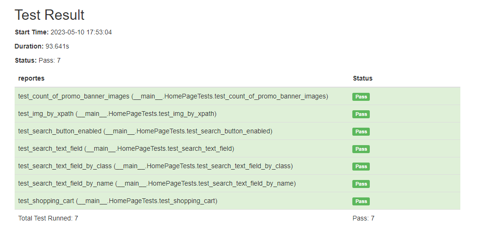


---------------------------------------------

**Assertions**

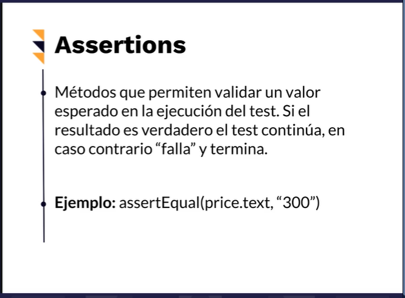

En el ejemplo afirmo que el atributo text del objeto price debe ser "Equal" a un string que contenga "300". 

**Test Suites**

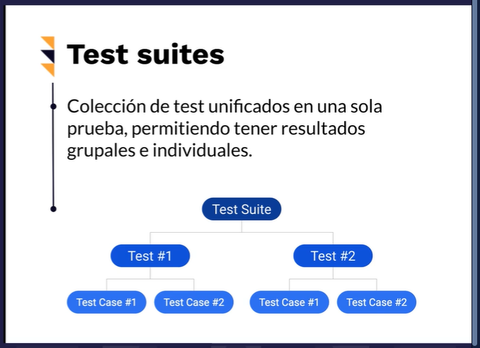

Una vez que tenemos armados los archivos con las pruebas que queremos hacer, debemos construir nuestra Suite de Test en la cual le indicaremos que test queremos hacer y en que orden. Lo llamaremos "smoketests.py"

Al correr "smoketests.py" se ejecuran todos los tests en el orden de archivos que haya establecido en mi suite. 

Realizando el suite de pruebas me di cuenta que HTMLTestRunner de pyunitreport es un fork de HTMLTestRunner que nos otorga un unico informe con los resultados de todas nuestras pruebas. Por ese motivo es conveniente usar directamente el segundo: 

Para instalarlo correr con el venv encendido: 

```bash
pip install html-testRunner
```
Para importarla librería se importa así:

```python
from HtmlTestRunner import HTMLTestRunner
```
Para guardar los reportes tiene sutiles cambios como se puede ver en HomePageTest.py:

Se establecen así los parametros del runner: 

```python
if __name__ == '__main__':
    unittest.main(verbosity= 2, testRunner= HTMLTestRunner(output= 'reports/reportes', report_name='home-page-test-report', add_timestamp=False))
```

-----------------------------------------------------------------------

## Entender las clases WebDriver y WebElement

Como viste en clases anteriores, un sitio web se construye por código HTML en forma de árbol, conteniendo distintos elementos con los que podemos interactuar según estén presentes o no en nuestra interfaz gráfica.

Selenium WebDriver nos brinda la posibilidad de poder referirnos a estos elementos y ejecutar métodos específicos para realizar las mismas acciones que un humano haría sobre los mismos, gracias a las clases WebDriver y WebElement.

**Clase WebDriver**

Cuenta con una serie de propiedades y métodos para interactuar directamente con la ventana del navegador y sus elementos relacionados, como son pop-ups o alerts. Por ahora nos centraremos a las más utilizadas.

Propiedades de la clase WebDriver

Estas son las más comunes para acceder al navegador:

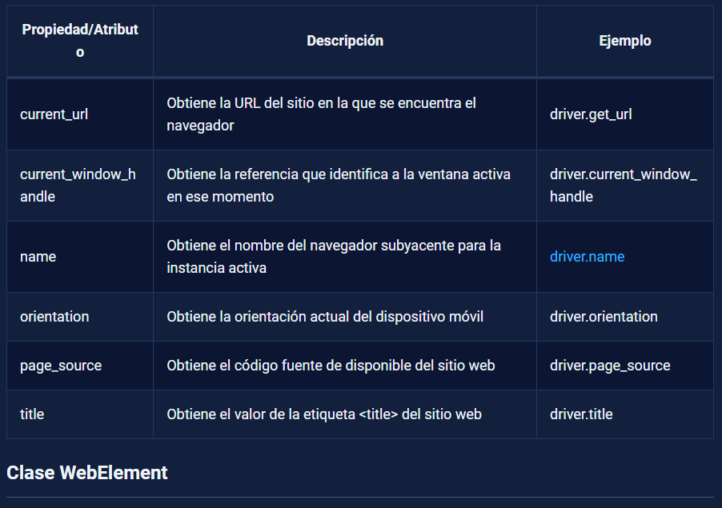

**Clase WebElement**

Esta clase nos permite interactuar específicamente con elementos de los sitios web como textbox, text area, button, radio button, checkbox, etc.

Propiedades más comunes de la clase WebElement:

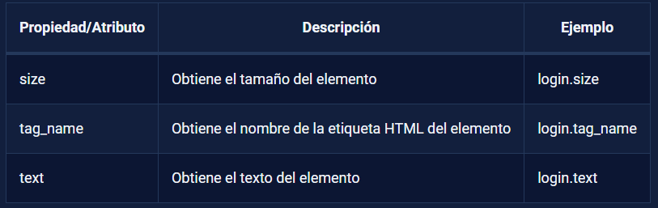

Métodos más comunes de la clase WebElement

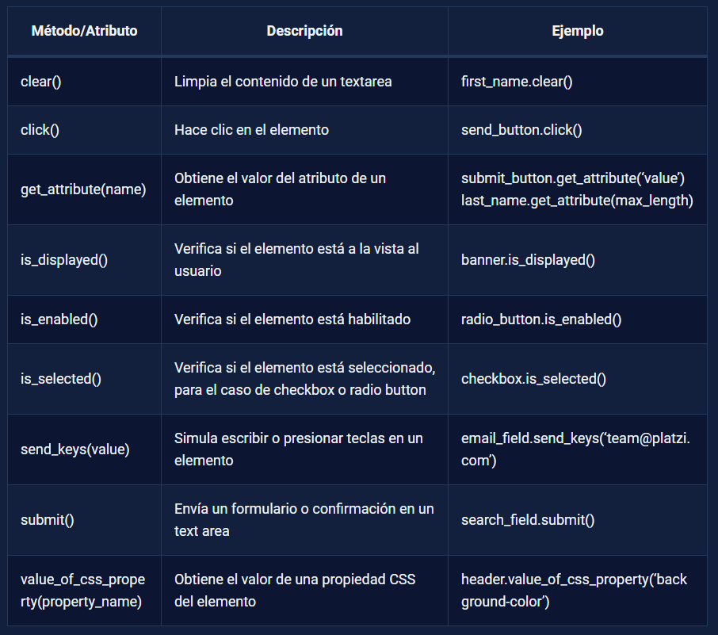

-------------------------------------------

### Vamos a automatizar el proceso de creación de una nueva cuenta para la pagina con la que hemos venido trabajando

Revisar archivo register_new_user.py

----------------------------------------------

### También podemos interactuar con elementos emergentes de las paginas como son los "alert" y los "pop-up"

Podemos ver como revisando el archivo alerts.py

------------------------------------------------

### Por supuesto, también podemos automatizar, y testear claro, la navegación entre las paginas que componen la web que estamos testeando

Podemos ver como revisando el archivo automatic_navigation.py

------------------------------------------------

### Demoras implicitas y explicitas:

Cuando ejecutamos de forma automatica acciones sobre un dominio podemos usar dos tipos distintos de demoras, en función de nuestra necesidad. Demoras implicitas yd demoras explicitas. 

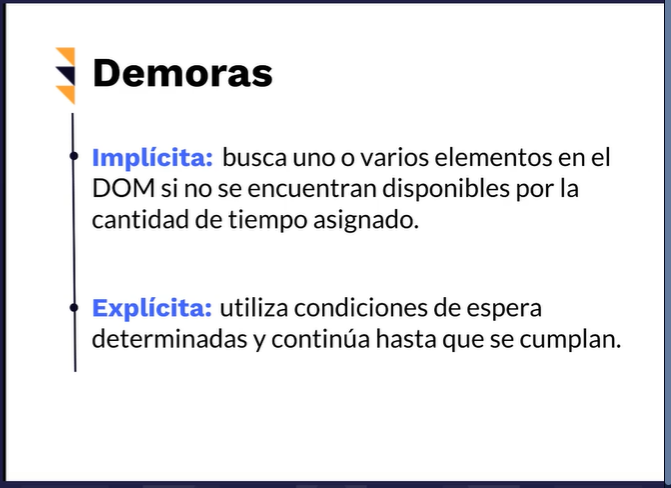

Podemos profundizar viendo el archivo waits.py

Algunas de las condiciones esperadas con las que cuenta selenium y podemos usar son:

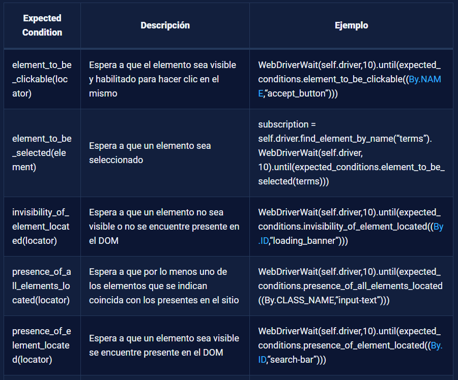
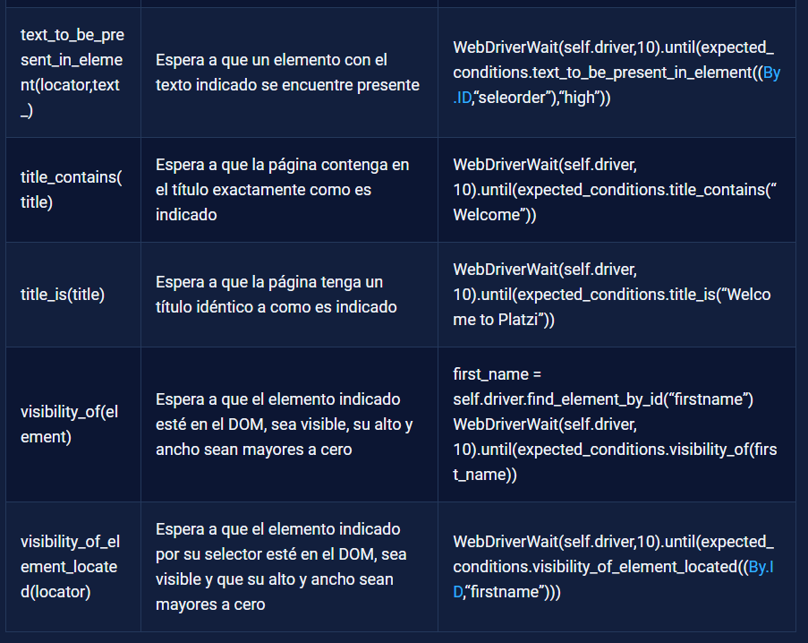


